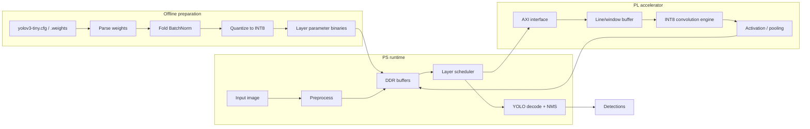

# YOLOv3-Tiny INT8 CNN Accelerator


A clean restart of a custom RTL accelerator for YOLOv3-Tiny CNN layers on the
PYNQ-Z2 programmable logic.

The project is intentionally scoped around the hardware/software boundary:
offline tools prepare folded INT8 weights, the PS side moves images and feature
maps through memory, and the PL side performs the expensive CNN datapath work in
Verilog.

> The previous prototype has been preserved under `legacy/`. New development
> starts from the structure below.

## Scope

| Layer | Responsibility |
| --- | --- |
| Offline tools | Parse Darknet weights, fold BatchNorm, quantize parameters |
| PS runtime | Load image/weights, manage DDR buffers, control PL, run YOLO decode and NMS |
| PL accelerator | Run INT8 convolution, accumulation, activation, padding, and pooling |

The first milestone is not full YOLO inference. It is one verified
YOLOv3-Tiny-style convolution layer:

```text
INT8 input activation
+ INT8 folded weights
+ INT32 accumulation
+ requantized INT8 output
+ Python golden-output comparison
```

## Repository Layout

```text
.
|-- docs/       Architecture notes and design decisions
|-- legacy/     Preserved prototype files from the first iteration
|-- models/     Model metadata and generated INT8 parameter notes
|-- rtl/        New Verilog RTL source tree
|-- scripts/    Offline conversion, quantization, and utility scripts
|-- sw/         PS-side runtime and board-control software
`-- tests/      Golden-model, RTL, and integration tests
```

The production RTL entry point is
[`rtl/active/top_single_conv_tile_axi.v`](rtl/active/top_single_conv_tile_axi.v).
Older and experimental `top_*` modules are isolated under `rtl/legacy/`; see
[`rtl/README.md`](rtl/README.md) for the complete source map.

## System Concept



## Development Plan

- [ ] Define fixed-point formats for input, weight, accumulator, and output.
- [ ] Build a Python golden model for one YOLOv3-Tiny convolution layer.
- [ ] Implement a clean INT8 convolution RTL block in `rtl/`.
- [ ] Add deterministic RTL tests and compare against golden outputs.
- [ ] Add folded-weight export scripts under `scripts/`.
- [ ] Add PS-side buffer/control code under `sw/`.
- [ ] Chain convolution, activation, and pooling.
- [ ] Measure timing/resource usage on PYNQ-Z2.

## Design Notes

- This is a custom RTL accelerator path, not a Xilinx DPU deployment flow.
- BatchNorm should be folded offline whenever possible.
- YOLO decode and NMS should stay on the PS side at first.
- Large pretrained weights and generated binaries should not be committed.
- Legacy files are kept for reference, but new RTL should be written in `rtl/`.

## PYNQ-Z2 Bring-Up Quick Start

The normal workflow uses the Vivado Tcl Console to create the IP and block
design, the Vivado GUI to generate the bitstream, and a Jupyter notebook to run
the board test. PowerShell is not required for this workflow.

### 1. Create the Vivado project and block design

Start **Vivado 2024.1** without opening an existing project. In the Vivado Tcl
Console, change to the repository root and source the project-generation script:

```tcl
cd {C:/path/to/CNN_YOLO_AI_accelerator}
source ./vivado/create_pynq_z2_project.tcl
```

Use forward slashes and keep braces around a path that contains spaces. The
script performs the following operations automatically:

- Packages the checked-in accelerator RTL as a local Vivado IP.
- Creates a PYNQ-Z2 project under `build/vivado/pynq_z2_cnn_gui`.
- Instantiates the Zynq PS, AXI DMA, SmartConnect, interrupt controller wiring,
  and the CNN accelerator.
- Connects the DMA memory path to the PS DDR interface.
- Assigns AXI addresses, validates the block design, and creates the HDL
  wrapper.
- Opens the completed block design in the Vivado GUI.

The step is complete when the Tcl Console prints:

```text
CNN_GUI: PASS
```

### 2. Generate the bitstream in the Vivado GUI

In **Flow Navigator**, click **Generate Bitstream** and wait for implementation
to finish. Before continuing, check the implemented timing summary:

```text
WNS >= 0 ns
TNS = 0 ns
Failing Endpoints = 0
```

The current design has been routed at 100 MHz with `WNS=+0.946 ns`,
`WHS=+0.019 ns`, and zero failing endpoints.

### 3. Build the Jupyter upload package

After bitstream generation succeeds, return to the same Vivado Tcl Console and
run:

```tcl
cd {C:/path/to/CNN_YOLO_AI_accelerator}
source ./vivado/export_pynq_jupyter_package.tcl
```

The script copies and consistently renames the `.bit` and `.hwh` files, adds
the smoke-test program and fixtures, and creates these two upload files:

```text
build/pynq_upload/pynq_z2_cnn_bringup.ipynb
build/pynq_upload/pynq_z2_cnn_jupyter.zip
```

The ZIP archive contains the matching overlay files, the Python smoke test,
and deterministic IC=1 and IC=3 test fixtures.

### 4. Upload and run the PYNQ notebook

Connect to the PYNQ-Z2 Jupyter server. For a direct Ethernet connection, the
default address is usually:

```text
http://192.168.2.99
```

When the board is connected through a router, use `http://<board-ip>` instead.
The default PYNQ username and password are both `xilinx`.

Upload both generated files from `build/pynq_upload/` to the Jupyter home page:

```text
pynq_z2_cnn_bringup.ipynb
pynq_z2_cnn_jupyter.zip
```

Open `pynq_z2_cnn_bringup.ipynb` and run all cells from top to bottom. The
notebook extracts the archive, verifies the required files, programs the PL,
allocates DMA buffers, runs the accelerator, and compares the hardware output
against the supplied golden output. It runs both of these checks:

- IC=1 single-input-channel compatibility test.
- IC=3 serial multi-input-channel accumulation test.

The automated Vivado project creation, archive contents, and notebook preflight
have been verified. Running the notebook on a physical PYNQ-Z2 is the remaining
hardware validation step.

## Board Design Notes

The complete reproduction procedure is documented in
[`docs/pynq-z2-reproduction-guide.md`](docs/pynq-z2-reproduction-guide.md).
The manual block-by-block explanation remains in
[`docs/pynq-z2-block-design-handoff-guide.md`](docs/pynq-z2-block-design-handoff-guide.md).

The board-bring-up candidate is the fixed 28x28 tile path documented in
[`docs/28x28-tile-conv-design.md`](docs/28x28-tile-conv-design.md). It keeps
only three 28-pixel rows in PL and uses separate parameter-load and tile-run
packets. Input channels are processed serially (`IC_PAR=1`); one BRAM36 stores
the INT32 partial-sum tile and only the final accumulated result enters the DMA
output FIFO. The protocol and measured results are documented in
[`docs/multi-input-channel-accumulation.md`](docs/multi-input-channel-accumulation.md).
IC=1 compatibility and IC=3 accumulation RTL simulations pass.

A separately synthesizable 16x16 alternative is also available. The measured
timing, utilization, latency, halo overhead, and 416x416 tiling comparison are
documented in
[`docs/tile-size-comparison-28-vs-16.md`](docs/tile-size-comparison-28-vs-16.md).
The 28x28 path remains the default because it has better whole-feature-map
efficiency; the 16x16 path is retained for low-latency and small-buffer tests.

## References

- [YOLOv3 paper](https://arxiv.org/abs/1804.02767)
- [Darknet](https://pjreddie.com/darknet/)
- [TinyYOLOv3-PyTorch](https://github.com/ValentinFigue/TinyYOLOv3-PyTorch)
- [Open Model Zoo](https://github.com/openvinotoolkit/open_model_zoo)
- [YOLO on PYNQ-Z2](https://andre-araujo.gitbook.io/yolo-on-pynq-z2)
- [Official PYNQ-Z2 setup guide](https://pynq.readthedocs.io/en/latest/getting_started/pynq_z2_setup.html)
