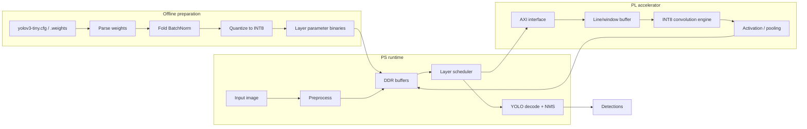

# YOLOv3-Tiny INT8 CNN Accelerator


A clean restart of a custom RTL accelerator for YOLOv3-Tiny CNN layers on the
PYNQ-Z2 programmable logic.

The project is intentionally scoped around the hardware/software boundary:
offline tools prepare folded INT8 weights, the PS side moves images and feature
maps through memory, and the PL side performs the expensive CNN datapath work in
Verilog.

> The previous prototype has been preserved under `legacy/`. New development
> starts from the structure below.

## Scope

| Layer | Responsibility |
| --- | --- |
| Offline tools | Parse Darknet weights, fold BatchNorm, quantize parameters |
| PS runtime | Load image/weights, manage DDR buffers, control PL, run YOLO decode and NMS |
| PL accelerator | Run INT8 convolution, accumulation, activation, padding, and pooling |

The first milestone is not full YOLO inference. It is one verified
YOLOv3-Tiny-style convolution layer:

```text
INT8 input activation
+ INT8 folded weights
+ INT32 accumulation
+ requantized INT8 output
+ Python golden-output comparison
```

## Repository Layout

```text
.
|-- docs/       Architecture notes and design decisions
|-- legacy/     Preserved prototype files from the first iteration
|-- models/     Model metadata and generated INT8 parameter notes
|-- rtl/        New Verilog RTL source tree
|-- scripts/    Offline conversion, quantization, and utility scripts
|-- sw/         PS-side runtime and board-control software
`-- tests/      Golden-model, RTL, and integration tests
```

## System Concept



## Development Plan

- [ ] Define fixed-point formats for input, weight, accumulator, and output.
- [ ] Build a Python golden model for one YOLOv3-Tiny convolution layer.
- [ ] Implement a clean INT8 convolution RTL block in `rtl/`.
- [ ] Add deterministic RTL tests and compare against golden outputs.
- [ ] Add folded-weight export scripts under `scripts/`.
- [ ] Add PS-side buffer/control code under `sw/`.
- [ ] Chain convolution, activation, and pooling.
- [ ] Measure timing/resource usage on PYNQ-Z2.

## Design Notes

- This is a custom RTL accelerator path, not a Xilinx DPU deployment flow.
- BatchNorm should be folded offline whenever possible.
- YOLO decode and NMS should stay on the PS side at first.
- Large pretrained weights and generated binaries should not be committed.
- Legacy files are kept for reference, but new RTL should be written in `rtl/`.

## Board Integration

The reproducible Vivado/PYNQ handoff procedure is documented in
[`docs/pynq-z2-block-design-handoff-guide.md`](docs/pynq-z2-block-design-handoff-guide.md).
The new board-bring-up candidate is the fixed 28x28 tile path documented in
[`docs/28x28-tile-conv-design.md`](docs/28x28-tile-conv-design.md). It keeps
only three 28-pixel rows in PL, streams completed INT32 outputs immediately to
the DMA FIFO, and uses separate parameter-load and tile-run packets. Exact RTL
and AXI simulations pass for 784 inputs and 676 outputs. XC7Z020-1 out-of-context
place-and-route also meets 100 MHz with positive setup slack. A full block-design
timing run is still required after connecting the PS, DMA, and interconnect.

A separately synthesizable 16x16 alternative is also available. The measured
timing, utilization, latency, halo overhead, and 416x416 tiling comparison are
documented in
[`docs/tile-size-comparison-28-vs-16.md`](docs/tile-size-comparison-28-vs-16.md).
The 28x28 path remains the default because it has better whole-feature-map
efficiency; the 16x16 path is retained for low-latency and small-buffer tests.

## References

- [YOLOv3 paper](https://arxiv.org/abs/1804.02767)
- [Darknet](https://pjreddie.com/darknet/)
- [TinyYOLOv3-PyTorch](https://github.com/ValentinFigue/TinyYOLOv3-PyTorch)
- [Open Model Zoo](https://github.com/openvinotoolkit/open_model_zoo)
- [YOLO on PYNQ-Z2](https://andre-araujo.gitbook.io/yolo-on-pynq-z2)
