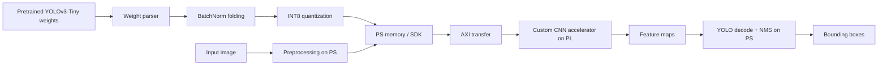

# YOLOv3-Tiny INT8 CNN Accelerator


A custom RTL accelerator project for running the CNN layer workload of
YOLOv3-Tiny on the programmable logic of a PYNQ-Z2 FPGA board.

This project explores a lightweight hardware path where the processing system
loads an image and quantized Darknet-format weights, transfers them to the
programmable logic, and lets custom Verilog modules perform CNN operations such
as convolution, padding, activation, and pooling.

> This is not a DPU deployment project. The goal is to understand and build the
> CNN compute blocks directly in RTL.

## Project Snapshot

| Area | Direction |
| --- | --- |
| Target model | YOLOv3-Tiny |
| Weight source | Pretrained Darknet YOLOv3-Tiny weights |
| Precision goal | INT8 weights and activations |
| Hardware target | PYNQ-Z2 / Zynq-7020 PL |
| Software role | Image preprocessing, weight loading, PL control, post-processing |
| PL role | CNN layer acceleration |
| Main tools | Verilog HDL, Xilinx Vivado, PYNQ / SDK-side software |

## System Concept



## Hardware Blocks

The repository is organized around small RTL blocks that can be verified and
composed into a larger inference pipeline.

| Block | Purpose |
| --- | --- |
| `conv_layer/` | 3x3 convolution, processing elements, systolic-array-style wiring |
| `padding_layer/` | Row buffering and zero-padding experiments for image windows |
| `maxpooling/` | 2x2 max-pooling units |
| `batch_norm/` | Fixed-point batch normalization experiments |
| `PYNQ/` | Image preprocessing notebook for board-side experimentation |
| `Reference/` | Software reference scripts and model exploration notes |

## Design Direction

The long-term pipeline is:

1. Parse `yolov3-tiny.cfg` and `yolov3-tiny.weights`.
2. Fold BatchNorm parameters into convolution weights and bias.
3. Quantize weights and activations to INT8.
4. Use the PS side to load image data and quantized parameters.
5. Stream feature maps and weights to the PL.
6. Execute convolution, activation, and pooling in custom RTL.
7. Return feature maps to the PS for YOLO decoding and NMS.

The first milestone is intentionally smaller:

```text
One YOLOv3-Tiny convolution layer
+ INT8 weights
+ INT8 input activation
+ INT32 accumulation
+ requantized INT8 output
+ software golden-output comparison
```

## Current Status

This repository is an early-stage RTL prototype. Several core blocks exist, but
the project is not yet a complete end-to-end YOLO inference implementation.

- Convolution, pooling, padding, and batch-normalization experiments are present.
- The top-level integration is still under development.
- Weight parsing, BatchNorm folding, and INT8 calibration need to be formalized.
- Reproducible simulation scripts and Vivado project automation are planned.

## Roadmap

- [ ] Clean up duplicate RTL modules and define a single source tree.
- [ ] Add deterministic Verilog testbenches for each hardware block.
- [ ] Build a Python golden model for one YOLOv3-Tiny convolution layer.
- [ ] Export folded and quantized layer weights.
- [ ] Match RTL output against the Python golden output.
- [ ] Add AXI-based PS-to-PL data movement.
- [ ] Chain convolution, activation, and pooling blocks.
- [ ] Document resource utilization and timing on PYNQ-Z2.

## Why This Project Matters

YOLO deployments on PYNQ-Z2 often rely on Xilinx DPU flows, where the neural
network is compiled for a vendor-provided accelerator. This project takes the
lower-level route: implementing the CNN datapath directly in RTL to study how
quantized inference maps onto FPGA logic.

That makes the project useful as a learning platform for:

- fixed-point CNN arithmetic
- weight quantization and BatchNorm folding
- FPGA dataflow design
- PS/PL communication on Zynq
- hardware/software co-design for edge AI

## References

- [YOLOv3 paper](https://arxiv.org/abs/1804.02767)
- [Darknet](https://pjreddie.com/darknet/)
- [TinyYOLOv3-PyTorch](https://github.com/ValentinFigue/TinyYOLOv3-PyTorch)
- [Open Model Zoo](https://github.com/openvinotoolkit/open_model_zoo)
- [YOLO on PYNQ-Z2](https://andre-araujo.gitbook.io/yolo-on-pynq-z2)
