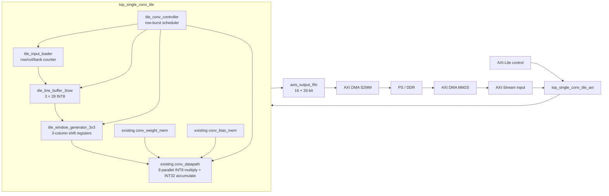

# 28×28 타일 컨볼루션 설계 및 연결 가이드

## 현재 구현 범위

이번 구현은 PYNQ-Z2 최초 보드 검증을 위한 최소 단위이다.

- 입력: `28×28×1`, INT8, row-major
- 커널: `3×3×1`, INT8
- 바이어스: 채널 하나의 INT32
- 연산: padding 없는 valid convolution
- 출력: `26×26×1 = 676`개의 INT32
- 인터페이스: AXI4-Lite 제어, AXI4-Stream 입력/출력
- 출력 저장: PL 전체 프레임 BRAM이 아니라 16-word FIFO를 거쳐 즉시 DDR 방향으로 전송

아직 전체 YOLOv3-Tiny 계층 실행기는 아니다. 다중 입력/출력 채널의 순차 누산,
1×1 convolution, requantization, activation, MaxPool은 다음 통합 단계에 해당한다.
별도 16×16 고정 top과의 측정 비교는
[`tile-size-comparison-28-vs-16.md`](tile-size-comparison-28-vs-16.md)에 정리되어 있다.

## 블록 구조



`28×28`은 커널 크기가 아니다. 커널은 계속 `3×3`이고, `28×28`은 PS와 PL이
한 번의 작업 단위로 합의한 feature-map 타일 크기이다. PL에는 784픽셀 전체를
저장하지 않고 현재 연산에 필요한 세 행, 즉 `3×28=84`픽셀만 유지한다.

주의: 현재 모듈은 padding 없는 valid convolution이므로 한 타일의 유효 출력은
`26×26`이다. 전체 feature map을 타일로 나눌 때 다음 입력 타일의 시작 위치는 28이
아니라 26이며, 이웃 입력 타일끼리 가로·세로 2픽셀 halo가 겹쳐야 경계의 3×3
window가 빠지지 않는다. YOLO의 padding=1 계층은 PS가 가장자리 halo를 0으로 채우거나
PL에 padding 로직을 추가한 뒤 처리해야 한다.

## 행 처리 순서

1. PS가 0, 1, 2행을 차례로 보낸다.
2. 세 행이 준비되면 PL이 출력 0행의 26개 3×3 window를 생성한다.
3. PS가 다음 한 행을 보낸다. 이 행은 가장 오래된 circular bank를 덮어쓴다.
4. top bank를 `0→1→2→0`으로 이동하고 다음 출력행을 계산한다.
5. 입력 28행과 출력 26행을 모두 처리할 때까지 반복한다.

행 끝 신호는 등록된 한-cycle 지연 pulse가 아니라 마지막 픽셀 handshake에서 바로
생성한다. 따라서 제어기가 한 픽셀을 더 수락하여 다음 bank의 0열을 덮어쓰는 문제가
없다.

## RTL 모듈 책임

| 모듈 | 책임 |
| --- | --- |
| `tile_input_loader.v` | AXIS handshake, row/col/bank 카운터, TLAST 오류 검출 |
| `tile_line_buffer_3row.v` | 세 개의 `28×8-bit` circular distributed RAM과 등록된 column read |
| `tile_window_generator_3x3.v` | 세 column shift, 3×3 window 생성, output backpressure 유지 |
| `tile_conv_controller.v` | 최초 3행 load, 행별 read/compute, 다음 행 load 순서 제어 |
| `top_single_conv_tile.v` | 위 모듈과 기존 weight/bias/MAC datapath 결합 |
| `axis_output_fifo.v` | DMA가 멈춰도 INT32 결과와 TLAST를 안정적으로 보존 |
| `top_single_conv_tile_axi.v` | AXI-Lite 명령/상태, parameter packet과 tile packet 구분 |

## PS 전송 프로토콜

같은 MM2S 채널을 parameter packet과 tile packet에 순차적으로 사용한다. 다중
입력 채널에서는 이 두 packet을 IC마다 반복하며 두 packet을 하나로 합치면 안 된다.

### 1. 파라미터 packet

1. `CTRL.LOAD_PARAM=1` 명령을 쓴다.
2. 10개 AXIS word를 전송한다.
3. word 0~8의 하위 8bit는 signed INT8 weight이다.
4. word 9의 32bit 전체는 signed INT32 bias이다.
5. word 9에서만 `TLAST=1`이어야 한다.

### 2. 입력 타일 packet

1. 마지막 입력 채널에서만 S2MM 출력 buffer를 먼저 준비한다.
2. `CTRL.RUN_TILE=1` 명령을 쓴다.
3. row-major 784개 AXIS word를 보낸다. 각 word의 하위 8bit만 INT8 픽셀이다.
4. 784번째 word에서만 `TLAST=1`이어야 한다.
5. 중간 입력 채널은 출력하지 않고 PL BRAM에 partial sum을 저장한다.
6. 마지막 입력 채널의 S2MM은 676개의 INT32 word를 받으며 마지막 출력에서 `TLAST=1`이다.

실행 전에 `TOTAL_IC`를 설정한다. 각 중간 채널이 끝나면 IRQ를 확인하고
`CLEAR_DONE` 후 다음 채널의 parameter/tile packet을 보낸다. 자세한 순서는
[`multi-input-channel-accumulation.md`](multi-input-channel-accumulation.md)를 참고한다.

## AXI-Lite 레지스터

| Offset | 이름 | 내용 |
| --- | --- | --- |
| `0x00` | CTRL | bit0 RUN_TILE, bit1 CLEAR_DONE, bit2 SOFT_RESET, bit3 LOAD_PARAM |
| `0x04` | STATUS | bit0 idle, bit1 loading, bit2 running, bit3 outputting, bit4 done, bit5 error, bit6 core busy, bit7 core done, bit11 parameter loaded, bit15:12 wrapper state |
| `0x08` | STREAM_IN | 현재 명령에서 수락한 입력 word 수 |
| `0x0c` | STREAM_OUT | 현재 타일에서 DMA가 수락한 출력 word 수 |
| `0x10` | TILE_INPUTS | `784` |
| `0x14` | TILE_OUTPUTS | `676` |
| `0x18` | ERROR | protocol/error flags |
| `0x1c` | PARAM_WORDS | `10` |
| `0x20` | TOTAL_IC | 순차 누적할 입력 채널 수, 1~1024 |
| `0x24` | CURRENT_IC | 현재 0-based 입력 채널 index |

`SOFT_RESET`은 실행 상태와 카운터를 초기화하지만 이미 적재한 weight/bias는 유지한다.
FPGA 전체 reset 후에는 반드시 `LOAD_PARAM`을 먼저 수행해야 한다.

## 검증 결과

Vivado Simulator 2024.1:

```text
PASS: tb_tile_window_path rows=4 windows=104
PASS: tb_single_conv_tile tile=28x28 inputs=784 outputs=676 cycles=6690 backpressure=1
PASS: tb_single_conv_tile_axi tile=28x28 inputs=784 outputs=676 cycles=6461 backpressure=1 continuous_input=0 status=0x00000811
PASS: tb_multi_ic_conv_tile_axi channels=3 tile=6x6 outputs=16 status=0x00000811
```

XC7Z020CLG400-1, 100 MHz, clock uncertainty 0.2 ns, OOC place/route:

```text
WNS  = +1.138 ns
TNS  =  0.000 ns
WHS  = +0.011 ns
LUT  = 1031
FF   = 705
BRAM18 = 9
DSP  = 0
```

다중 입력 채널 partial-sum buffer가 포함된 최신 OOC 결과는 WNS `+1.234 ns`,
TNS `0`, setup failing endpoint `0`이다. 676x32-bit partial sum은 RAMB36 한 개로
합성되었다.

출력 FIFO는 24개 LUTRAM과 13개 FF로 합성되었다. OOC 결과는 내부
register-to-register 경로를 검증하며 미제약 내부 endpoint는 0개이다. AXI 최상위
포트에는 OOC input/output delay를 지정하지 않았으므로 최종 block design에서는 PS
FCLK, AXI DMA/interconnect, reset, 실제 clock buffer 위치까지 포함한 전체
implementation timing을 다시 확인해야 한다.

## 재현 명령

```powershell
xvlog -f rtl/filelists/tile_window_tb.f
xelab tb_tile_window_path -s tb_tile_window_path_sim
xsim tb_tile_window_path_sim -runall

xvlog -f rtl/filelists/tile_conv_tb.f
xelab tb_single_conv_tile -s tb_single_conv_tile_sim
xsim tb_single_conv_tile_sim -runall

xvlog -f rtl/filelists/tile_conv_axi_tb.f
xelab tb_single_conv_tile_axi -s tb_single_conv_tile_axi_sim
xsim tb_single_conv_tile_axi_sim -runall

$env:TILE_CONV_REPO = (Get-Location).Path
vivado -mode batch -source scripts/synth_tile_conv_ooc.tcl
```
