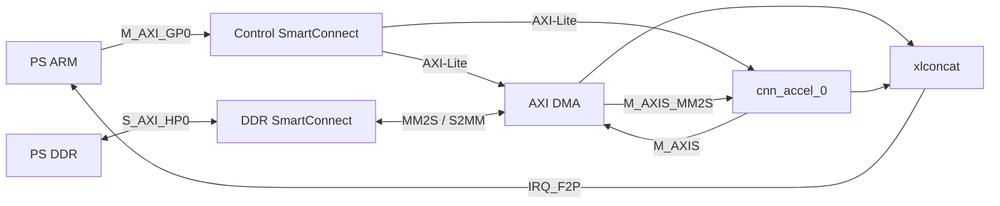

# PYNQ-Z2 Vivado GUI 및 Jupyter 재현 가이드

## 1. 이 가이드의 작업 흐름

팀원이 따라야 하는 기본 흐름은 다음 네 단계다.

1. Vivado 2024.1을 열고 Tcl Console에서 프로젝트 생성 Tcl을 실행한다.
2. 자동으로 만들어진 Block Design을 확인하고 GUI에서 Generate Bitstream을 누른다.
3. Tcl Console에서 Jupyter 업로드 묶음을 생성한다.
4. PYNQ-Z2의 Jupyter 화면에 노트북과 ZIP을 올리고 셀을 순서대로 실행한다.

PowerShell 빌드는 CI나 무인 재검증을 위한 보조 경로일 뿐, 최초 보드 테스트의 기본
절차가 아니다.

## 2. 현재 검증 결과

2026-08-20에 Vivado 2024.1과 `xc7z020clg400-1` 대상으로 확인한 결과다.

| 항목 | 결과 |
| --- | --- |
| RTL 회귀 테스트 | 4/4 PASS |
| Block Design Validate | PASS |
| 구현 클록 | FCLK0 100 MHz 단일 도메인 |
| post-route WNS / TNS | `+0.946 ns` / `0.000 ns` |
| post-route WHS | `+0.019 ns` |
| setup failing endpoints | `0 / 23,476` |
| route failed/unrouted nets | `0 / 0` |
| DRC | Error 0, Warning 1, Advisory 2 |
| 전체 자원 | LUT 5,218, FF 6,608, RAMB36 3, RAMB18 0, DSP 0 |
| 가속기 자원 | LUT 1,187, FF 915, RAMB36 1, RAMB18 0, DSP 0 |

PC의 bitstream 생성까지 검증했다. 실제 보드 결과는 8절의 IC=1/IC=3 테스트로
확정한다.

## 3. Block Design 구조



| 경로 | 고정 연결 또는 주소 |
| --- | --- |
| DMA control | `0x4040_0000`, 64 KiB |
| accelerator control | `0x43C0_0000`, 64 KiB |
| DMA memory | PS DDR `0x0000_0000`, 512 MiB |
| input stream | `axi_dma_0/M_AXIS_MM2S -> cnn_accel_0/S_AXIS` |
| output stream | `cnn_accel_0/M_AXIS -> axi_dma_0/S_AXIS_S2MM` |
| interrupts | MM2S, S2MM, accelerator IRQ -> `IRQ_F2P` |

현재 custom IP는 28×28×IC signed INT8 입력과 채널별 3×3 signed INT8 weight를
처리한다. IC는 1~1024를 순차 누적하고, 마지막 채널 뒤 26×26=676개의 signed
INT32 결과를 출력한다. 현재 병렬도는 `IC_PAR=1`, `OC=1`이다.

## 4. Vivado에서 프로젝트와 Block Design 자동 생성

### 4.1 준비

- Vivado 2024.1을 사용한다.
- 저장소는 GitHub `main`을 clone하거나 Code → Download ZIP으로 내려받는다.
- Windows 경로 길이 문제를 피하려면 `C:/fpga/CNN_YOLO_AI_accelerator`처럼 짧고
  공백 없는 경로에 둔다.
- 별도 PYNQ-Z2 board file을 설치할 필요는 없다. 공식 PYNQ-Z2 PS DDR/MIO 설정이
  체크인된 Tcl에 포함되어 있다.

### 4.2 Tcl Console 입력

Vivado 2024.1을 실행하되 프로젝트를 먼저 만들지 않는다. 시작 화면에서
`Window > Tcl Console`을 연 다음 아래 두 줄을 입력한다. 경로는 실제 저장소
위치로 바꾼다.

```tcl
cd {C:/fpga/CNN_YOLO_AI_accelerator}
source ./vivado/create_pynq_z2_project.tcl
```

스크립트가 자동으로 수행하는 작업:

- `cnn_tile_accel_ip` custom IP 패키징
- PYNQ-Z2 PS/DDR/MIO 설정
- AXI DMA와 두 SmartConnect 생성
- AXI-Lite, MM2S, S2MM, HP0 DDR 연결
- FCLK0 100 MHz clock/reset 연결
- DMA와 가속기 interrupt 연결
- 주소 할당과 Validate Design
- output products와 HDL wrapper 생성

약 2~5분 후 Block Design `pynqz2`가 열리고 다음 문구가 나와야 한다.

```text
CNN_GUI: PASS project=...
CNN_GUI: Block Design pynqz2 is open and validated
CNN_GUI: Next click Flow Navigator > Generate Bitstream
```

## 5. GUI에서 bitstream 생성

1. 왼쪽 `Flow Navigator`에서 `Generate Bitstream`을 누른다.
2. synthesis와 implementation도 실행하겠다는 창이 나오면 `Yes`를 누른다.
3. 완료될 때까지 기다린다. PC 성능에 따라 약 10~20분 걸릴 수 있다.
4. 완료 창에서 `Open Implemented Design`을 선택한다.
5. `Reports > Timing > Report Timing Summary`에서 WNS와 WHS가 모두 0 이상인지
   확인한다.

합격 기준:

- bitstream 생성 성공
- `All user specified timing constraints are met.`
- WNS ≥ 0, WHS ≥ 0
- failing endpoint 0
- DRC Error 0

현재 확인된 기준값은 WNS `+0.946 ns`, WHS `+0.019 ns`다. 배치·배선 seed나 PC
환경에 따라 양수 범위 안에서 값이 조금 달라질 수 있다.

## 6. Jupyter 업로드 파일 자동 생성

bitstream 생성이 끝난 뒤 Vivado Tcl Console에서 다음을 실행한다. 4절 스크립트가
저장소 root로 현재 디렉터리를 되돌려 놓으므로 그대로 입력할 수 있다.

```tcl
source ./vivado/export_pynq_jupyter_package.tcl
```

성공 문구:

```text
CNN_EXPORT: PASS notebook=.../build/pynq_upload/pynq_z2_cnn_bringup.ipynb
CNN_EXPORT: PASS archive=.../build/pynq_upload/pynq_z2_cnn_jupyter.zip
```

`build/pynq_upload/`에 다음 두 업로드 파일이 만들어진다.

| 업로드 파일 | 내용 |
| --- | --- |
| `pynq_z2_cnn_bringup.ipynb` | Jupyter에서 실행할 노트북 |
| `pynq_z2_cnn_jupyter.zip` | bit, HWH, Python test, IC=1/IC=3 fixture |

ZIP 내부의 `.bit`와 `.hwh`는 PYNQ가 자동으로 연결하도록 같은 basename
`pynq_z2_cnn`으로 저장된다.

## 7. PYNQ-Z2 Jupyter에 업로드

1. PYNQ image가 들어 있는 SD 카드로 보드를 부팅한다.
2. PC와 직접 연결한 기본 설정이면 브라우저에서 `http://192.168.2.99`를 연다.
   공유기 DHCP를 사용하면 `http://<보드 IP>`를 연다.
3. 기본 로그인은 username `xilinx`, password `xilinx`다.
4. Jupyter 홈 화면의 `Upload`를 눌러 아래 두 파일을 선택한다.
5. 파일 목록에 나타난 각 파일 옆의 파란색 `Upload` 버튼을 다시 누른다.

```text
pynq_z2_cnn_bringup.ipynb
pynq_z2_cnn_jupyter.zip
```

PYNQ 공식 설정과 네트워크 연결은 [PYNQ-Z2 Setup Guide](https://pynq.readthedocs.io/en/latest/getting_started/pynq_z2_setup.html)를 기준으로 한다.

## 8. Jupyter Notebook에서 실행할 내용

업로드한 `pynq_z2_cnn_bringup.ipynb`를 열고 셀을 위에서 아래로 실행한다.
`Cell > Run All`을 사용해도 된다.

노트북의 실행 순서는 다음과 같다.

1. ZIP을 `pynq_z2_cnn/` 폴더에 자동 압축 해제
2. bit/HWH/test/fixture 누락 여부 확인
3. IC=1 bit-exact DMA smoke test 실행
4. IC=3 partial-sum 누적 smoke test 실행

IC=1 합격 문구:

```text
PASS: PYNQ-Z2 AXI DMA smoke test input_channels=1 parameters_per_channel=10 inputs_per_channel=784 outputs=676
```

IC=3 합격 문구:

```text
PASS: PYNQ-Z2 AXI DMA smoke test input_channels=3 parameters_per_channel=10 inputs_per_channel=784 outputs=676
```

테스트 스크립트는 마지막 입력 채널에서 S2MM receive를 먼저 arm하고 그다음
MM2S와 가속기를 시작한다. 이 순서는 출력 backpressure로 인한 정지를 피하기 위해
바꾸지 않는다.

두 테스트가 모두 PASS하면 다음 전체 경로가 bit-exact로 검증된 것이다.

```text
PS DDR -> DMA MM2S -> PL convolution/IC accumulation -> DMA S2MM -> PS DDR
```

## 9. 알려진 Vivado 메시지

- PYNQ-Z2 DDR DQS skew `-0.009`, `-0.033`: AMD/Xilinx 공식 보드 설정에서 가져온
  보정값이므로 임의로 0으로 바꾸지 않는다.
- SmartConnect payload width 경고: 사용하지 않는 AXI optional sideband 제거 과정에서
  발생하며 Block Design Validate와 구현은 통과한다.
- `RTSTAT-10` 1개: control SmartConnect 내부에서 최적화된 reset pipe net이다.
- `REQP-181` advisory 2개: AMD AXI DMA 내부 FIFO BRAM이다.

새로운 DRC Error, 음수 WNS/WHS, 또는 `cnn_accel_0` 내부 `REQP-1839/1840` 경고가
생기면 정상 결과로 간주하지 않는다.

## 10. 보조 자동화

GUI 없이 전체 회귀를 다시 돌려야 할 때만 아래 PowerShell 스크립트를 사용한다.

```powershell
powershell -ExecutionPolicy Bypass -File .\vivado\run_rtl_tests.ps1
powershell -ExecutionPolicy Bypass -File .\vivado\build_pynq_z2.ps1
```

보드 담당자가 돌려줄 내용은 Git commit, Vivado/PYNQ 버전, IC=1·IC=3 notebook
출력 전체다. 실패하면 notebook에 표시된 `status`, `stream_in`, `stream_out`,
`errors`와 Python 예외를 함께 전달한다.

## 11. 기준 자료

- [AMD/Xilinx PYNQ-Z2 Vivado 2024.1 PS Tcl](https://github.com/Xilinx/PYNQ/blob/master/boards/Pynq-Z2/petalinux_bsp/hardware_project/pynqz2.tcl)
- [PYNQ Overlay design methodology](https://pynq.readthedocs.io/en/latest/overlay_design_methodology/overlay_design.html)
- [PYNQ-Z2 setup guide](https://pynq.readthedocs.io/en/latest/getting_started/pynq_z2_setup.html)
